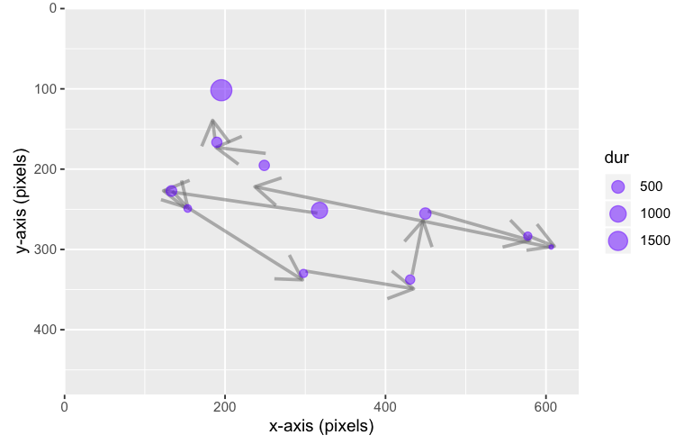

# eyelinker

[](https://CRAN.R-project.org/package=eyelinker)
[](https://travis-ci.org/a-hurst/eyelinker)
[](https://codecov.io/gh/a-hurst/eyelinker)
[](https://www.tidyverse.org/lifecycle/#maturing)

An R package for importing plain-text ASC data files from EyeLink eye trackers into (relatively) tidy data frames. EDF files first must be converted to ASC using the `edf2asc` tool before they can be imported.



**NOTE**: This branch is currently under development, and the internal ASC-reading logic has been
rewritten entirely to improve compatibility and speed. Here is a short-list of the changes:

 - `read.asc` is now 4 to 5x faster than before
 - Rows with missing eye data now retain non-missing values instead of replacing all with `NA`
 - ASC files with INPUT/BUTTON data are now supported
 - Is able to handle ASC files with malformed START/END blocks
 - Is optionally able to parse out-of-block events
 - Is able to correctly parse ASC files with HREF events
 - The `$info` table now contains date of recording, tracker model, tracker mount type, display
   resolution, and sample rate information.
 
However, it is possible that this version breaks support for certain files or workflows. If you encounter any issues
with this version, please let me know and I'll do my best to fix them.

## Installation

```r
# Install the latest release from CRAN:
install.packages("eyelinker")

# Install the latest development version from GitHub:
require(devtools)
devtools::install_github("a-hurst/eyelinker")
```

## Usage

```r
library(eyelinker)

# Example file from SR research that ships with the package
fpath <- system.file("extdata/mono500.asc.gz", package = "eyelinker")
dat <- read.asc(fpath)
plot(dat$raw$time, dat$raw$xp,xlab = "Time (ms)", ylab = "Eye position along x-axis (pix)")

# For more info:
vignette("basics", package = "eyelinker")
```

## Credits

* Author: Simon Barthelmé, CNRS, Gipsa-lab
* Maintainer: Austin Hurst, University of Waterloo
